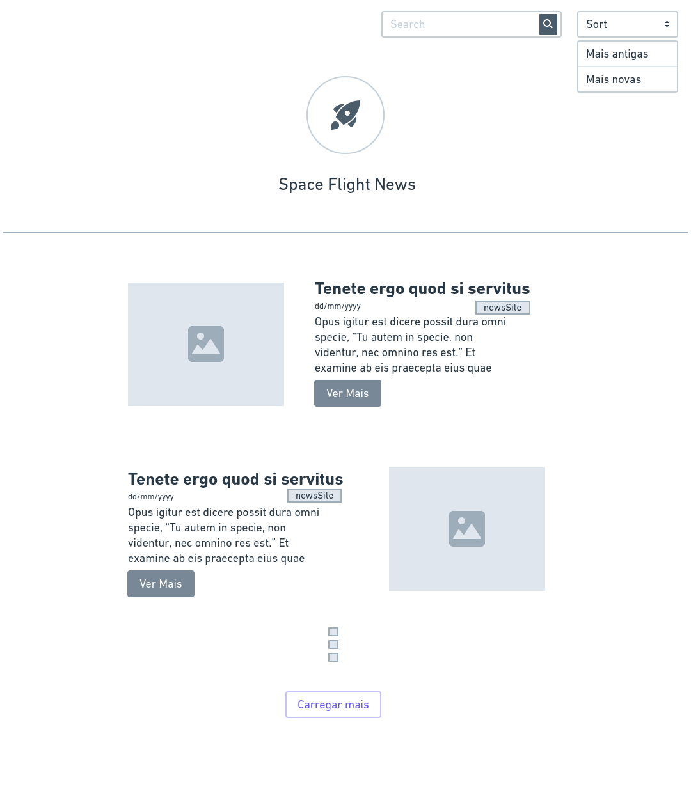
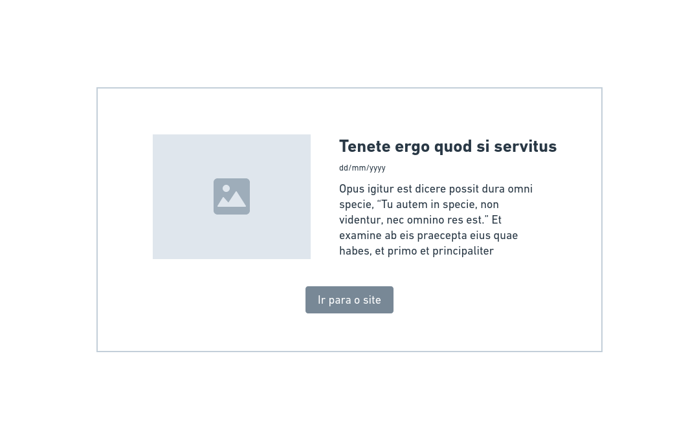
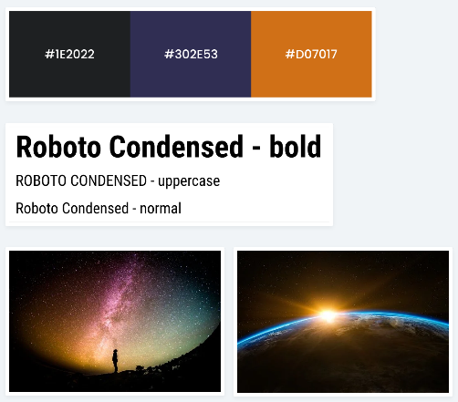

# Front-end Challenge 🏅- Space Flight News

## Introdução

>  This is a challenge by [Coodesh](https://coodesh.com/)

Nesse desafio foi proposto desenvolver uma aplicação web para consumir as informações da API [Space Flight News](https://api.spaceflightnewsapi.net/v3/documentation), uma API pública com informações relacionadas a voos espaciais.

O projeto desenvolvido tem como objetivo exibir os dados dos artigos, com o título, imagem, resumo e data de publicação, seguindo o wireframe que você encontrará logo abaixo. Durante o desenvolvimento foi proposto me atentar, ao desenvolver a aplicação front-end, para conceitos de usabilidade e adequar o wireframe com elementos visuais para os usuários do sistema.

### Front-End:

Nessa etapa foi desenvolvida uma aplicação web para consumir a API, e limitando o `request` para exibir apenas 10 resultados.

### Tecnologias utilizadas:

- Vue.js;
- Vuex;
- Vue Router;
- Para o desenvolvimento me foi recomendado utilizar algum framework CSS. Eu escolhi o BootstrapVue: https://bootstrap-vue.org/

#### Wireframe - listagem de artigos

 

#### Wireframe - modal

 

#### Cores, fontes e inspiração

### Requisitos obrigatórios e diferenciais: 

**Obrigatório 1** - Seguir o wireframe para a página de listagem de artigos; ✅

**Obrigatório 2** - Seguir o wireframe do modal. Esse modal deverá ser aberto com informações dos artigos no momento que o usuário clicar no botão "Ver Mais"; ✅

**Obrigatório 3** - Seguir a paleta de cores e as fontes definidas na imagem acima; ✅

**Obrigatório 4** - Desenvolver a funcionalidade do buscador para que seja possível listar artigos que contenham as palavras no título; ✅

**Obrigatório 5** - Desenvolver a funcionalidade para ordenar os artigos por data, da mais antiga para a mais nova e da mais nova para a mais antiga; ✅

**Obrigatório 6** - Ao clicar no botão "Carregar mais" deve fazer uma nova requisição para carregar mais 10 artigos na página. ✅

#### Dos requisitos diferenciais, foi feito: 

**Escrever Unit Tests ou E2E Test. Fiz os testes unitários, utilizando Jest + vue test utils✅**

